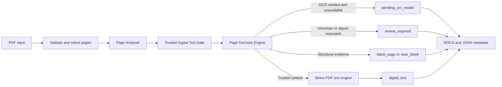

# Clouda OCR

[](https://github.com/sahrasayed3-crypto/clouda-ocr/actions/workflows/ci.yml)
[](LICENSE)

Clouda OCR is an open-source, model-agnostic document-intelligence runtime for Arabic, English, and mixed-language PDFs. Today it converts trusted born-digital PDF text into RTL-aware, editable DOCX with explicit page-level routing — and it ships the data, evaluation, and training-preparation infrastructure for Arabic OCR while a final trained OCR model remains deliberately unbuilt.

The installed Python package is named `clouda-pdf` for historical reasons; the project is Clouda OCR.

## Why this exists

Arabic document digitization is harder than English OCR: right-to-left text, mixed Arabic-English reading order, footnotes and margins, and weak or medium-quality scans of modern and historical books. Researchers, publishers, and archives need editable documents without silently losing page context or implying OCR accuracy that has not been measured. Clouda OCR makes the supported digital-text path explicit and preserves uncertain pages for review instead of guessing.

## What works today

- Extract trusted embedded text from born-digital PDF pages without OCR, into a valid editable DOCX with page breaks and RTL-aware Arabic paragraphs.
- Classify every page through categorical gate and routing states: `digital_text`, `blank_page`, `near_blank`, `pending_ocr_model`, `review_required`.
- Detect image-only scanned pages and keep them in an explicit `pending_ocr_model` review state — never presented as OCR output.
- Self-review configured local OCR categorically and re-read only verified, bounded image regions; unresolved OCR remains review-required.
- Preserve short page-number text rather than discarding it.

## What makes Clouda different

- **Page-level trust, not blind extraction.** Every page passes the canonical Page Analyzer → Trusted Digital Text Gate → Page Decision Engine sequence. Embedded text must pass the trust gate before direct extraction is authorized; a post-extraction digest mismatch forces `review_required` and the untrusted text is omitted.
- **Provider-independent by construction.** A model-agnostic `ExtractionEngine` and `EngineRegistry` mean the runtime does not depend on any single upstream OCR/VLM model. Benchmark candidates are evaluated; none is the identity of Clouda.
- **OCR review and selective re-read.** Configured local OCR is self-reviewed and only verified, bounded image regions are re-read — cost control with categorical, not confidence-based, decisions.
- **Fail-closed licensing as an engineering property.** Dataset, model, output-redistribution, and training-label rights are separate fields; unknown rights fail closed as `LOCAL_ONLY` or `NEEDS_REVIEW`.
- **Offline and self-hosted orientation.** Local OCR and GPU training are disabled by default; the Clouda Lab dashboard binds loopback only and never downloads datasets or models during normal navigation.
- **Reproducible evaluation.** A metadata-only, hash-pinned 177-page Arabic benchmark with sanitized provenance and documented exclusions.

## Current status

| Capability | Status |
|---|---|
| Born-digital PDF → RTL-aware DOCX (digital-text route) | Implemented, CI-tested |
| Page Analyzer → Trusted Digital Text Gate → Page Decision Engine routing | Implemented, CI-tested |
| Blank / near-blank / review-required page states with per-page metadata | Implemented, CI-tested |
| OCR Self-Review and Selective Re-read | Implemented (CI-tested with local fakes; no production model) |
| Model-agnostic engine registry and provider abstraction | Implemented |
| Arabic OCR data foundation (rendering, distortion, QC, license-gated export) | Implemented |
| Training experiment framework (planner, preflight, deterministic CPU mock runs) | Implemented; real training fail-closed |
| Final trained Clouda OCR model | **Not built** — deliberately; candidates are benchmarked, not adopted |
| Production OCR inference / hosted service | Not built |
| GPU benchmark cycle (177-page Arabic) | Completed for this cycle; see [benchmark](benchmarks/ocr_arabic/README.md) |
| Layout-perfect reconstruction (tables, images, margins) | Not attempted; text fidelity is the priority |

No final trained OCR model exists. Model training and local OCR inference remain disabled by default. Scanned pages are not treated as successful OCR output until a model is licensed for the intended use, integrated, trained or adapted as needed, and validated in the application route.

## Architecture



One repository with isolated domains and external state: `pdfword` (production PDF-to-DOCX runtime), `clouda_data` (dataset preparation, evaluation, and the integrated Data Factory), `clouda_contracts` (dependency-light boundary), `clouda_training` (planning and reproducible offline mock experiments), and `clouda_models` (model metadata, no weights). Runtime files, datasets, and caches resolve through `StorageRoots` and stay outside Git. See [ARCHITECTURE.md](ARCHITECTURE.md).

## Engineering evidence

- **Cross-platform CI** (Windows + Ubuntu, Python 3.11) running lint (ruff), formatting (black), types (mypy), a compile gate, import/CLI smoke tests, and the deep doctor self-test. [Latest workflow runs](https://github.com/sahrasayed3-crypto/clouda-ocr/actions/workflows/ci.yml).
- **Large automated test suite**: 1,895 test functions across 202 test files (static count) covering routing, trust gating, DOCX validity, security bounds, Lab contracts, and benchmark release validation. Run the suite for live numbers rather than quoting a snapshot.
- **Security tooling**: repository scan (`python -m tools.validation.repository_scan --root .`), bounded uploads, archive traversal/expansion checks, `defusedxml`, header-key worker API, pinned GitHub Actions SHAs, and an [SBOM](SBOM.json). See [SECURITY.md](SECURITY.md).
- **Deterministic fixtures**: tests use copyright-free, deterministic local fixtures; no dataset or model downloads in CI.

## Install (Windows)

```powershell
py -3.11 -m venv .venv311
.\.venv311\Scripts\python.exe -m pip install --upgrade pip
.\.venv311\Scripts\python.exe -m pip install -r requirements-dev.txt
```

For the complete merged dependency set:

```powershell
.\.venv311\Scripts\python.exe -m pip install -c constraints\py311.txt -e ".[server,worker,data,training,models,test,dev]"
```

Runtime and dataset state must be external. Configure
`CLOUDA_RUNTIME_ROOT`, `CLOUDA_DATASET_ROOT`, `CLOUDA_ARTIFACT_ROOT`,
`CLOUDA_MODEL_ROOT`, and `CLOUDA_CACHE_ROOT`; see `.env.example`.

The data foundation and training planner are available as:

```powershell
python -m clouda_data.pipeline.cli --help
python -m clouda_training.cli plan --config configs\training\smoke-100.json --catalog dataset_catalog\registry\datasets_v1.json
python -m clouda_training.cli validate-config configs\training\mock-experiment.yaml
python -m clouda_training.cli dry-run configs\training\mock-experiment.yaml
```

The experiment flow is a reproducible CPU-only mock run: it downloads no model
or dataset and performs no real training. See the
[training experiment framework guide](docs/training/EXPERIMENT_FRAMEWORK.md).

## Run

```powershell
.\.venv311\Scripts\python.exe -m streamlit run app.py
```

Open `http://127.0.0.1:8501`.

## Test and validate

```powershell
.\.venv311\Scripts\python.exe -m pytest --cov=pdfword --cov-report=term-missing
.\.venv311\Scripts\python.exe -m ruff check .
.\.venv311\Scripts\python.exe -m black --check .
.\.venv311\Scripts\python.exe -m mypy .
```

The repository contains focused suites for each subsystem. Run the commands
above for the current checkout rather than relying on a historical test-count
snapshot; known environment-specific exceptions, when present, are documented
in the corresponding subsystem documentation.

For a bounded CPU-only conversion release check, with no model or dataset
download, run:

```powershell
python -m clouda_data.pipeline.cli doctor --deep
```

Its PDF self-test generates tiny local fixtures and checks the canonical
trusted-text, blank, and OCR-required routes plus DOCX page boundaries. CUDA
is informational only; this command performs no GPU inference, training, or
benchmarking.

## Demo

The demo processes copyright-free local fixtures and writes a DOCX plus per-page JSON metadata:

```powershell
.\.venv311\Scripts\python.exe scripts\demo.py
```

It demonstrates digital text extraction, DOCX generation, a scanned page routed to `pending_ocr_model`, and a blank page routed to `blank_page`.

## Example outcome

| Input page | Result | Output |
| --- | --- | --- |
| PDF page whose embedded text passes the trust gate | `digital_text` | Extracted text in DOCX |
| Image-only scanned page | `pending_ocr_model` | Explicit review state and JSON metadata |
| Empty page | `blank_page` | Page boundary retained |
| Structurally near-empty page | `near_blank` | Page boundary and categorical state retained |
| Uncertain page or post-extraction digest mismatch | `review_required` | Visible review placeholder; untrusted text omitted |

## Arabic OCR data foundation

The merged repository now includes a real CPU/Pillow image pipeline:

- bounded PDF/image rendering;
- deterministic real-pixel distortion with versioned YAML profiles;
- batch checkpoint/resume, validation, quarantine, and HTML previews;
- CER/WER execution and license-gated training-data export;
- safe local OCR adapters with feature-flagged runtime integration.

All generated files stay under `CLOUDA_STATE_HOME`. Local OCR and GPU training
remain disabled by default. Start with:

```powershell
python -m clouda_data.pipeline.cli --help
python -m clouda_training.cli --help
```

### Clouda Lab internal dashboard

Clouda Lab is a separate loopback-only FastAPI control plane over the
canonical local datasets, quality gate, planner, preflight, adapters, runs,
checkpoints, Results Store, benchmarks, and Doctor diagnostics. Start it from
the repository root:

```powershell
.\.venv311\Scripts\python.exe -m clouda_lab.cli serve
```

Open `http://127.0.0.1:8000/lab`. The command rejects non-loopback bind
addresses. Normal navigation is offline-only and never downloads datasets,
models, checkpoints, or benchmark assets. Dataset sample downloads are limited
to approved canonical manifests and require a review plus a short-lived,
single-use confirmation. Model downloads, dependency installation, and
published-model benchmark execution are not exposed.

The Document Intelligence page accepts an explicit PDF submission (up to
10 MiB and 25 pages), analyzes it in memory, and displays categorical routing
states, evidence, and reason codes. It does not persist the upload or expose
user-facing accuracy, confidence, or quality percentages.

Real training is conditionally available only when a managed model asset has
passed canonical verification and the canonical preflight reports no blockers.
The no-GPU/no-model state is fully usable for catalog, quality, planning,
results, benchmark metadata, Doctor, task, and storage inspection.

### Pre-training stage status

Ready now: local source registration and deterministic discovery, provenance-
preserving manifests, conservative Arabic normalization, validation, exact
deduplication, leakage-safe train/validation/test/protected-holdout splitting,
generic training JSONL export, and the declarative Data Factory handoff boundary.
See [the pre-training infrastructure guide](docs/pretraining_dataset_infrastructure.md).

Not done yet: real large-scale dataset ingestion, model training, a final trained
OCR model, production model inference or serving, and a paid hosted OCR service.
Those are later stages and are not implied by the presence of preparation or
training-planning code.

## Benchmark status

A separate metadata-only
[177-page Arabic OCR benchmark](benchmarks/ocr_arabic/README.md)
(`clouda-ocr-arabic-177-v1`) documents controlled model-evaluation results
without changing the application route. Public contents include results,
methodology, hashes, sanitized provenance, rights classifications, and
validation code only; all image, ground-truth, raw-output, and permission
evidence remains private and local.

Key results, with their caveats: HunyuanOCR-1.5 ranked first by Normalized
Arabic CER (0.391497) on this specific 177-page distorted Arabic benchmark.
This does not establish universal model superiority or commercial usability;
model licenses and output rights are tracked separately and remain
`NEEDS_REVIEW`. Runtime figures across different GPUs are explicitly not a
controlled speed comparison. See
[RESULTS.md](benchmarks/ocr_arabic/RESULTS.md) and
[methodology.md](benchmarks/ocr_arabic/methodology.md).

## Current limitations

- Model adaptation/training and runtime integration are the next major technical stage. Progress on that stage is currently limited primarily by access to suitable GPU compute. Dataset and model rights remain governed separately by the existing fail-closed licensing and provenance process.
- Production application accuracy is not claimed.
- Layout-perfect reconstruction, tables, images, margins, and footnotes are not rebuilt as DOCX objects; page boundaries and extracted text are retained.
- AMD/ROCm readiness is architectural and diagnostic only. No GPU inference or training has been validated.
- Qwen, Kraken, PaddleOCR, Tesseract, and other OCR candidates are benchmark candidates only until legally usable, installed, and evaluated on the same ground-truth set.

## External tools

Do not commit Poppler, OCR runtimes, virtual environments, or GPU toolkits into this repository. If a future workflow needs Poppler, install it outside the repo and add its `bin` directory to `PATH`, for example `C:\tools\poppler\Library\bin`.

## Roadmap

See [ROADMAP.md](ROADMAP.md), [docs/ROADMAP.md](docs/ROADMAP.md), and [docs/MODEL_INTEGRATION.md](docs/MODEL_INTEGRATION.md). The current leading benchmark candidate will become the final OCR engine only if architecture, licensing, deployment, integration, and subsequent validation requirements are satisfied.

## Documentation

- [Architecture](docs/ARCHITECTURE.md)
- [Testing](docs/TESTING.md)
- [Final Arabic OCR benchmark](benchmarks/ocr_arabic/README.md)
- [Model integration](docs/MODEL_INTEGRATION.md)
- [Data licenses](DATA_LICENSES.md)
- [Third-party notices](THIRD_PARTY_NOTICES.md)
- [Security](SECURITY.md)
- [Contributing](CONTRIBUTING.md)
- [Investor-facing GitHub audit (2026-09-20)](docs/investor-github-audit.md)

## Open-Source Scope

This repository contains the public open-source portion of Clouda OCR: the application structure, model-agnostic interfaces, OCR engine registry, page routing, blank and near-blank page handling, quality and review workflow, public evaluation utilities, tests, documentation, and safe examples.

Some components are intentionally not included in this repository. Training data, private reference texts, final model weights, LoRA/QLoRA adapters, checkpoints, production service code, customer data, proprietary data-collection tools, advanced private training recipes, and sensitive deployment configuration may be licensed, hosted, or distributed separately.

The Apache License 2.0 in `LICENSE` applies to original Clouda OCR source code and original project materials actually present in this public repository, unless otherwise noted. It does not cover private or separately licensed components or externally sourced materials.

The following are not included in the public Apache 2.0 license grant: datasets, private reference texts, model weights, final OCR model artifacts, LoRA/QLoRA adapters, checkpoints, training recipes, final hyperparameters, production configuration, hosted service code, deployment secrets, customer data, uploaded PDFs, generated DOCX output, local permission evidence under `docs/permissions/`, trademarks, logos, project names, and brand assets.

This repository does not claim ownership of external datasets or third-party OCR models. Any future data or model release must include its own license, source, permission, and redistribution terms.

## License

Original Clouda OCR source code and original project materials are licensed under the Apache License 2.0 unless otherwise noted.

Third-party datasets, models, benchmark source materials, citations, and other externally sourced materials remain subject to their respective licenses, permissions, and terms.

See [LICENSE](LICENSE) and [NOTICE](NOTICE).
