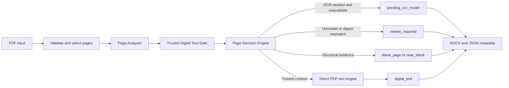

# Clouda PDF

[](https://app.ona.com/#https://github.com/sahrasayed3-crypto/clouda-ocr)

> The repository now includes the production runtime plus isolated data,
> training-planning, model-registry, and shared-contract subsystems. The
> pre-training dataset-preparation infrastructure is ready and frozen pending
> real data ingestion. No final trained OCR model exists; model training and
> local OCR inference remain disabled by default.

Clouda PDF is an open-source, model-agnostic PDF-to-DOCX project for Arabic, English, and mixed-language documents. Its long-term goal is open, self-hostable, independently evaluated Arabic Document AI infrastructure for real-world documents: reliable Arabic OCR and document understanding for modern and historical books, including weak or medium-quality scanned pages, margins, footnotes, RTL text, and mixed Arabic-English reading order. Existing OCR/VLM models are evaluated first; a dedicated Clouda model may be trained or adapted only when benchmark evidence shows a meaningful gap that existing open and self-hostable models do not adequately solve.

The current verified implementation converts trusted born-digital PDF text into editable, text-only DOCX files while preserving page order, Arabic Unicode, RTL paragraph direction, footers, and page boundaries. Embedded text is analyzed and must pass the canonical digital-text trust gate before direct extraction is authorized. Image-only scanned pages are detected and routed to `pending_ocr_model`; they are not treated as successful OCR output until a model is licensed for the intended use, integrated, trained or adapted as needed, and validated in the application route.

It is designed for modern and historical Arabic books as well as English and mixed-language documents. Text fidelity is the priority. The project does not currently attempt layout-perfect reconstruction of images, tables, or page artwork.

## Why it exists

Researchers, publishers, and archives need editable documents without silently losing page context or implying OCR accuracy that has not been measured. Clouda PDF makes the supported digital-text path explicit and preserves uncertain pages for review.

## Current capabilities

- Extract trusted embedded text from born-digital PDF pages without OCR.
- Generate a valid editable DOCX with page breaks and RTL-aware Arabic paragraphs.
- Classify pages through categorical gate and routing states, including `digital_text`, `blank_page`, `near_blank`, `pending_ocr_model`, and `review_required`.
- Preserve short page-number text rather than discarding it.
- Use a model-agnostic `ExtractionEngine` and `EngineRegistry` for a future OCR integration.
- Keep scanned, low-quality, and image-only pages in an explicit review state instead of claiming unmeasured OCR accuracy.
- Self-review configured local OCR categorically and re-read only verified, bounded image regions; unresolved OCR remains review-required.



## Install (Windows)

```powershell
py -3.11 -m venv .venv311
.\.venv311\Scripts\python.exe -m pip install --upgrade pip
.\.venv311\Scripts\python.exe -m pip install -r requirements-dev.txt
```

For the complete merged dependency set:

```powershell
.\.venv311\Scripts\python.exe -m pip install -c constraints\py311.txt -e ".[server,worker,data,training,models,test,dev]"
```

Runtime and dataset state must be external. Configure
`CLOUDA_RUNTIME_ROOT`, `CLOUDA_DATASET_ROOT`, `CLOUDA_ARTIFACT_ROOT`,
`CLOUDA_MODEL_ROOT`, and `CLOUDA_CACHE_ROOT`; see `.env.example`.

The data foundation and training planner are available as:

```powershell
python -m clouda_data.pipeline.cli --help
python -m clouda_training.cli plan --config configs\training\smoke-100.json --catalog dataset_catalog\registry\datasets_v1.json
python -m clouda_training.cli validate-config configs\training\mock-experiment.yaml
python -m clouda_training.cli dry-run configs\training\mock-experiment.yaml
```

The experiment flow is a reproducible CPU-only mock run: it downloads no model
or dataset and performs no real training. See the
[training experiment framework guide](docs/training/EXPERIMENT_FRAMEWORK.md).

## Run

```powershell
.\.venv311\Scripts\python.exe -m streamlit run app.py
```

Open `http://127.0.0.1:8501`.

## Test and validate

```powershell
.\.venv311\Scripts\python.exe -m pytest --cov=pdfword --cov-report=term-missing
.\.venv311\Scripts\python.exe -m ruff check .
.\.venv311\Scripts\python.exe -m black --check .
.\.venv311\Scripts\python.exe -m mypy .
```

The repository contains focused suites for each subsystem. Run the commands
above for the current checkout rather than relying on a historical test-count
snapshot; known environment-specific exceptions, when present, are documented
in the corresponding subsystem documentation.

For a bounded CPU-only conversion release check, with no model or dataset
download, run:

```powershell
python -m clouda_data.pipeline.cli doctor --deep
```

Its PDF self-test generates tiny local fixtures and checks the canonical
trusted-text, blank, and OCR-required routes plus DOCX page boundaries. CUDA
is informational only; this command performs no GPU inference, training, or
benchmarking.

## External tools

Do not commit Poppler, OCR runtimes, virtual environments, or GPU toolkits into this repository. If a future workflow needs Poppler, install it outside the repo and add its `bin` directory to `PATH`, for example `C:\tools\poppler\Library\bin`.

## Demo

The demo processes copyright-free local fixtures and writes a DOCX plus per-page JSON metadata:

```powershell
.\.venv311\Scripts\python.exe scripts\demo.py
```

It demonstrates digital text extraction, DOCX generation, a scanned page routed to `pending_ocr_model`, and a blank page routed to `blank_page`.

## Arabic OCR data foundation

The merged repository now includes a real CPU/Pillow image pipeline:

- bounded PDF/image rendering;
- deterministic real-pixel distortion with versioned YAML profiles;
- batch checkpoint/resume, validation, quarantine, and HTML previews;
- CER/WER execution and license-gated training-data export;
- safe local OCR adapters with feature-flagged runtime integration.

All generated files stay under `CLOUDA_STATE_HOME`. Local OCR and GPU training
remain disabled by default. Start with:

```powershell
python -m clouda_data.pipeline.cli --help
python -m clouda_training.cli --help
```

### Clouda Lab internal dashboard

Clouda Lab is a separate loopback-only FastAPI control plane over the
canonical local datasets, quality gate, planner, preflight, adapters, runs,
checkpoints, Results Store, benchmarks, and Doctor diagnostics. Start it from
the repository root:

```powershell
.\.venv311\Scripts\python.exe -m clouda_lab.cli serve
```

Open `http://127.0.0.1:8000/lab`. The command rejects non-loopback bind
addresses. Normal navigation is offline-only and never downloads datasets,
models, checkpoints, or benchmark assets. Dataset sample downloads are limited
to approved canonical manifests and require a review plus a short-lived,
single-use confirmation. Model downloads, dependency installation, and
published-model benchmark execution are not exposed.

The Document Intelligence page accepts an explicit PDF submission (up to
10 MiB and 25 pages), analyzes it in memory, and displays categorical routing
states, evidence, and reason codes. It does not persist the upload or expose
user-facing accuracy, confidence, or quality percentages.

The dashboard stores persistent operation records under `runs/.lab-tasks`,
managed model selections under `runs/.lab-models`, deterministic plans under
`runs/.lab-plans` and `runs/.lab-benchmark-plans`, and recoverable removals
under `runs/.lab-trash`. It accepts managed IDs only: dataset imports resolve
under `data/imports`, downloaded samples under `data/downloads`, and model
assets under `data/models`.

Real training is conditionally available only when a managed model asset has
passed canonical verification and the canonical preflight reports no blockers.
The no-GPU/no-model state is fully usable for catalog, quality, planning,
results, benchmark metadata, Doctor, task, and storage inspection. Training
stop remains unavailable until the canonical runtime provides cooperative
cancellation; checkpoint resume uses the canonical integrity and identity
checks.

### Pre-training stage status

Ready now: local source registration and deterministic discovery, provenance-
preserving manifests, conservative Arabic normalization, validation, exact
deduplication, leakage-safe train/validation/test/protected-holdout splitting,
generic training JSONL export, and the declarative Data Factory handoff boundary.
See [the pre-training infrastructure guide](docs/pretraining_dataset_infrastructure.md).

Not done yet: real large-scale dataset ingestion, model training, a final trained
OCR model, production model inference or serving, and a paid hosted OCR service.
Those are later stages and are not implied by the presence of preparation or
training-planning code.

## Example outcome

| Input page | Result | Output |
| --- | --- | --- |
| PDF page whose embedded text passes the trust gate | `digital_text` | Extracted text in DOCX |
| Image-only scanned page | `pending_ocr_model` | Explicit review state and JSON metadata |
| Empty page | `blank_page` | Page boundary retained |
| Structurally near-empty page | `near_blank` | Page boundary and categorical state retained |
| Uncertain page or post-extraction digest mismatch | `review_required` | Visible review placeholder; untrusted text omitted |

## Current limitations

- Benchmarking is complete. Runtime integration and validation of the leading benchmark candidate are the next major technical stage; progress on that stage is currently limited primarily by access to suitable GPU compute. A dedicated Clouda-trained model would be pursued only if evaluation on real-world Arabic documents shows a meaningful gap that existing open and self-hostable models do not adequately close. Dataset and model rights remain governed separately by the existing fail-closed licensing and provenance process.
- HunyuanOCR-1.5 is the current leading candidate based on this specific 177-page benchmark (Normalized Arabic CER 0.391497). Final production/runtime selection remains subject to architecture, licensing, deployment constraints, integration, and subsequent validation.
- Production application accuracy is not claimed. A separate metadata-only
  [177-page Arabic OCR benchmark](benchmarks/ocr_arabic/README.md) documents
  controlled model-evaluation results without changing the application route.
- Layout-perfect reconstruction, tables, images, margins, and footnotes are not rebuilt as DOCX objects; page boundaries and extracted text are retained.
- AMD/ROCm readiness is architectural and diagnostic only. No GPU inference or training has been validated.
- Qwen, Kraken, PaddleOCR, Tesseract, and other OCR candidates are benchmark candidates only until legally usable, installed, and evaluated on the same ground-truth set.

## Roadmap

See [ROADMAP.md](ROADMAP.md), [docs/ROADMAP.md](docs/ROADMAP.md), and [docs/MODEL_INTEGRATION.md](docs/MODEL_INTEGRATION.md). The current leading candidate will become the final OCR engine only if architecture, licensing, deployment, integration, and subsequent validation requirements are satisfied.

## Documentation

- [Architecture](docs/ARCHITECTURE.md)
- [Testing](docs/TESTING.md)
- [Final Arabic OCR benchmark](benchmarks/ocr_arabic/README.md)
- [Model integration](docs/MODEL_INTEGRATION.md)
- [Data licenses](DATA_LICENSES.md)
- [Third-party notices](THIRD_PARTY_NOTICES.md)
- [Security](SECURITY.md)
- [Contributing](CONTRIBUTING.md)

## Open-Source Scope

This repository contains the public open-source portion of OCR_PROJECT / Clouda PDF: the application structure, model-agnostic interfaces, OCR engine registry, page routing, blank and near-blank page handling, quality and review workflow, public evaluation utilities, tests, documentation, and safe examples.

Some components are intentionally not included in this repository. Training data, private reference texts, final model weights, LoRA/QLoRA adapters, checkpoints, production service code, customer data, proprietary data-collection tools, advanced private training recipes, and sensitive deployment configuration may be licensed, hosted, or distributed separately.

The Apache License 2.0 in `LICENSE` applies to original Clouda OCR source code and original project materials actually present in this public repository, unless otherwise noted. It does not cover private or separately licensed components or externally sourced materials.

The following are not included in the public Apache 2.0 license grant: datasets, private reference texts, model weights, final OCR model artifacts, LoRA/QLoRA adapters, checkpoints, training recipes, final hyperparameters, production configuration, hosted service code, deployment secrets, customer data, uploaded PDFs, generated DOCX output, local permission evidence under `docs/permissions/`, trademarks, logos, project names, and brand assets.

This repository does not claim ownership of external datasets or third-party OCR models. Any future data or model release must include its own license, source, permission, and redistribution terms.

## License

Original Clouda OCR source code and original project materials are licensed under the Apache License 2.0 unless otherwise noted.

Third-party datasets, models, benchmark source materials, citations, and other externally sourced materials remain subject to their respective licenses, permissions, and terms.

See [LICENSE](LICENSE) and [NOTICE](NOTICE).
